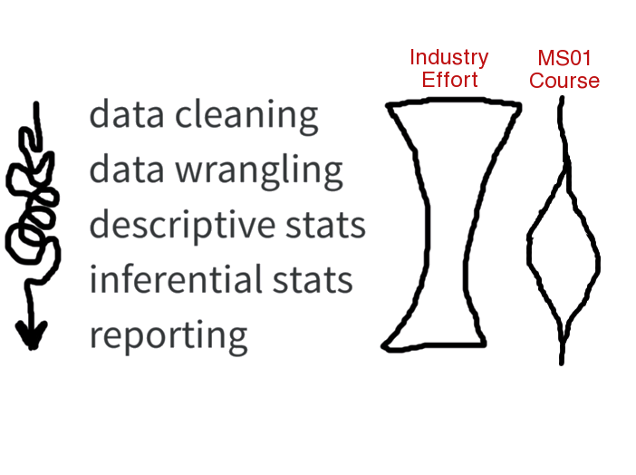
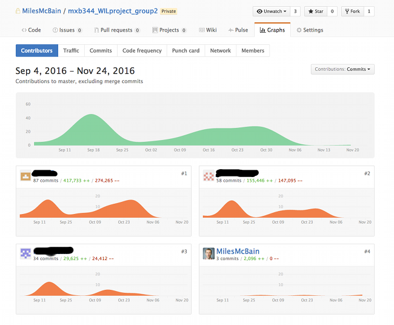
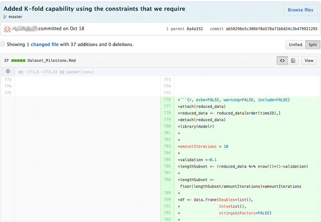

```{r, include=FALSE, echo=FALSE}
library(readr)
library(ggplot2)
library(dplyr)
```

## Brief
TAKE "MXB344 - Modelling Non-Normal Data with Generalised Linear Models"
 
 * An applied unit with useful theory but outdated problems, tools, and assesment. 

AND REMODEL Into a Worked Integrated Learning capstone unit.

 * Industry Involvement: Bank of Queensland
 * Realistic Tasks
 * Authentic Assessment
 * For 6 students


#Learning Experience Design

## Enagaging BOQ
Dr Burton Wu - Senior Manager, Quantitative Modelling (BOQ)

`+`

Me - ex Customer Intelligence Officer (Suncorp)

Discovered:

* Very similar ideas about the gap between the skills statistics graduates are taught and those they need to be effective in industry.
* Burton's motivation: Recruitment!

## Technical Skills: Dat Gap
<centre></centre>

## Softer Skills
Need:

* Scoping open ended tasks
* Eliciting requirements
* Resolving ambiguity
* Planning/Managing a large project
* Targetting communication

Strategy: **Coaching over teaching.**

## Skills for the future
* Git/GitHub
* Reproducibility
* Automation


#Overview of MXB344 Sem 2 2016

##Assessment Outline
* Individual Project: Poisson Regression Emergency
    - Reproducible Analytical Report (RMarkdown)
    - Summary on a Page (SOAP)
    - Submit on GitHub 
* Major Group Project: Credit Risk Model
    - Weekly Delivery Plan Update
    - Interim R.A. Report
    - Boardroom meeting
    - Reproducible Analytical Report
    - SOAP
    - Performance Review
    - Submit on GitHub

##Major Group Project
* Real data from a personal lending portfolio
    - Large, messy, and in pieces. :'(
    - Mixed bag: Credit file metrics to free text descriptions.
    - Data dictionary ambiguous.
* BOQ Engagement:
    - Introduce problem, background knowledge.
    - Attended 1x Workshop for Q&A
    - Sat in Boardroom meetings. Grilled students! :)

##Course Outline
Built **bottom-up** from the Assessments:

* Modern Data Analysis Workflow: Reproducibility, Automation.
* Generalised Linear Models: Poission, Binomial, Normal, Multinomial.
* Data wrangling: dplyr
* Feature Engineering.
* Cross Validation: caret, purrr.
* Tree-Based Models (CART, Random Forest)
* etc.

##What Exam?


##What Exam?


#Feedback

##From the Teacher
* HARD work. 
* Rewarding to see students respond to challenge.
* Good connection with industry made.
* Would do again.

##From the Students +
> I liked this unit. It was brutal but that was the fun of it.

> I am glad that Chris asked us a lot of questions during presentation as it really assist us to improve our model and guide us to provide better discussion for our final report. 

> I think both the individual and group assignments reflected real world problems. The way the assignment questions were set up made me feel as though I was writing up a report to present my work to my managers in the real world.

> I love playing with real world data in a simulated challenge. One thing that I might suggest is bringing a much tougher challenge.

##From the Students -
> To me, integrated learning should be about having a real client who gets deliverables that help them.

> The industry engagement component of the unit was mildly useful...I don’t feel that it was a strong or consistent engagement on their part.

> I didn’t get the impression that BOQ was particularly interested in the outcome of any of the assignments. 

> if only two case of GLM (poisson & logistic) was considered in our assessments, it would be irrelevant to put other GLM as part of a learning content, since this will not be used for summative assessments.

##Overall StudentFeedback
* All would recommend unit to others.
* All thought assessment represented real world problems.
* All gave positive personal feedback to MXB344 teaching team.

## Outstanding Questions
* Scalability?
* Industry Partner Satisfied?

